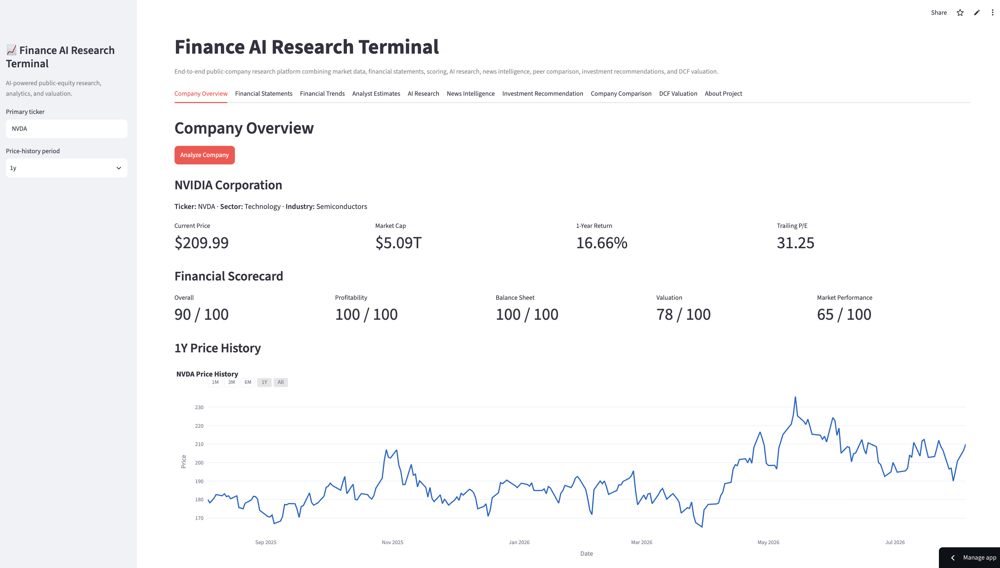
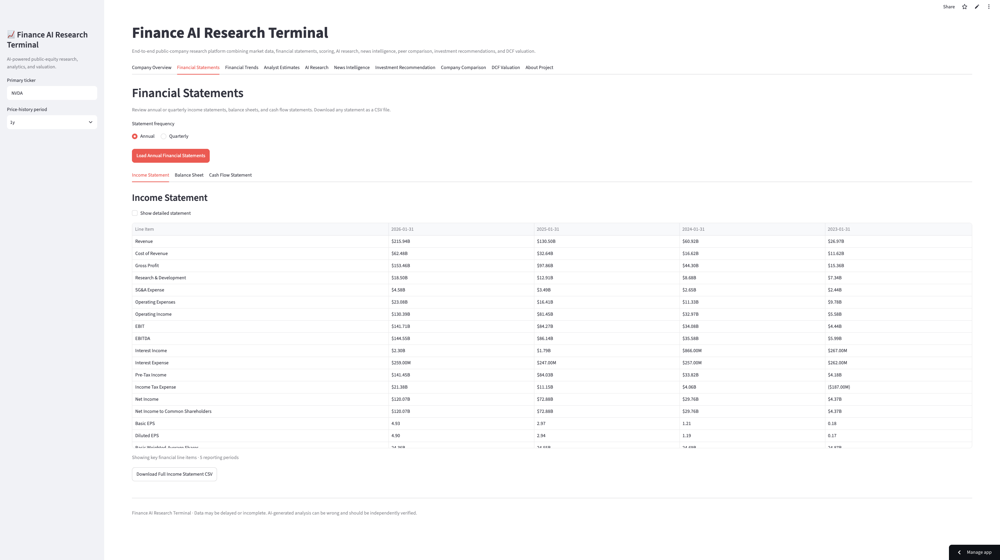
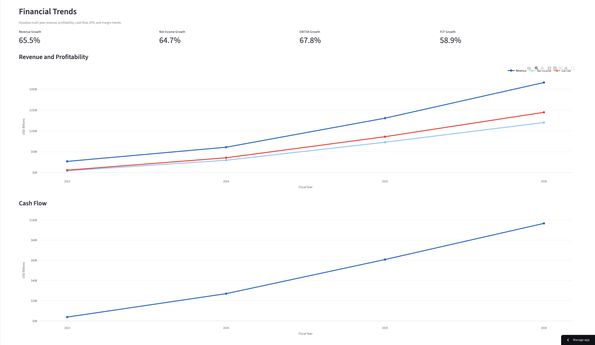

# 📈 Finance AI Research Terminal

> An AI-powered equity research platform that analyzes public companies using financial statements, valuation models, analyst estimates, news intelligence, peer comparison, and AI-generated investment research.



---

## 🚀 Live Demo

**Application:** https://finance-ai-research-terminal.streamlit.app/ 

**GitHub Repository:** https://github.com/Mykeysee-bot/finance-ai-research-terminal

---

# Overview

Finance AI Research Terminal is a Python and Streamlit application designed to provide institutional-style research for publicly traded companies.

Instead of gathering information from multiple websites, the application combines market data, financial statements, valuation analysis, analyst estimates, AI research, and news into a single interactive dashboard.

Users can also generate professional multi-page PDF equity research reports.

---

# Features

- 📊 Company Overview
- 📈 Annual & Quarterly Financial Statements
- 📉 Multi-Year Financial Trend Analysis
- 🤖 AI Company Research
- 📰 AI News Intelligence
- 💰 Discounted Cash Flow (DCF) Valuation
- 📋 DCF Scenarios & Sensitivity Analysis
- 📑 Analyst Estimates & Price Targets
- ⚖️ Company Comparison
- ⭐ Financial Scorecard
- 📄 Professional PDF Research Report Export

---

# Dashboard

### Company Overview


---

### Financial Statements



---

### Financial Trends



---

### Company Comparison


---

### DCF Valuation


---

# Technology Stack

| Category | Technology |
|-----------|------------|
| Language | Python |
| Frontend | Streamlit |
| Data Analysis | Pandas |
| Visualization | Plotly |
| Market Data | yfinance |
| AI | OpenAI API |
| PDF Generation | ReportLab |
| Environment | python-dotenv |

---

# Architecture

```text
                 User

                   │

                   ▼

      Finance AI Research Terminal

                   │

 ┌─────────────────┼─────────────────┐
 │                 │                 │
 ▼                 ▼                 ▼

Market Data     AI Analysis     News Intelligence

 │                 │                 │

 └──────────────┬──┴─────────────────┘
                │
                ▼

      Financial Models & Scoring

                │
                ▼

         Interactive Dashboard

                │
                ▼

     Professional PDF Research Report
```

---

# Installation

Clone the repository:

```bash
git clone https://github.com/YOUR_USERNAME/finance-ai-agent.git
cd finance-ai-agent
```

Create a virtual environment:

```bash
python3 -m venv .venv
source .venv/bin/activate
```

Install dependencies:

```bash
pip install -r requirements.txt
```

Create a `.env` file:

```text
OPENAI_API_KEY=your_api_key_here
```

Run the application:

```bash
streamlit run app.py
```

---

# Project Highlights

- Built an AI-powered public equity research platform using Python and Streamlit.
- Integrated market data, financial statements, analyst estimates, valuation models, and AI-generated research into a unified workflow.
- Developed interactive dashboards with Plotly visualizations and downloadable CSV exports.
- Implemented discounted cash flow valuation with scenario and sensitivity analysis.
- Generated professional multi-page PDF research reports using ReportLab.

---

# Future Improvements

- Portfolio tracking
- SEC filing analysis
- Earnings transcript summarization
- Insider trading analysis
- Watchlists
- Multi-company portfolio analytics

---

# Disclaimer

This application is intended for educational and research purposes only.

Market data may be delayed or incomplete. AI-generated analysis may contain inaccuracies and should not be considered investment, legal, or financial advice. Always conduct independent research before making investment decisions.

---

## Author

**Michael Corrigan**

Finance Student | AI Builder | Python Developer
